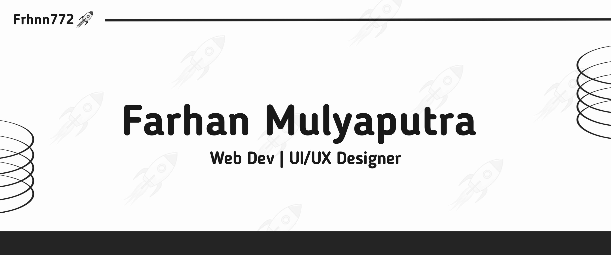

## **About Me**
* I've an interest in software development
* I'm a web development
* Currently i'm learning about web development both on front end and backend

## **Tech I've been working with:**
| **Technology** 💻 | **Experience** 🚀 |
| :-- | :--: |
|  | 1 Years 8 Month
|  | 1 Years 4 Month
|  | 1 Years 5 Month
|  | 1 Years 6 Month
|  | 1 Years 4 Month
|  | 1 Years 2 Month
|  | 1 Years 2 Month

 

 
<b>More Information</b>

 

## **Github Stats**
  
  
  

 

